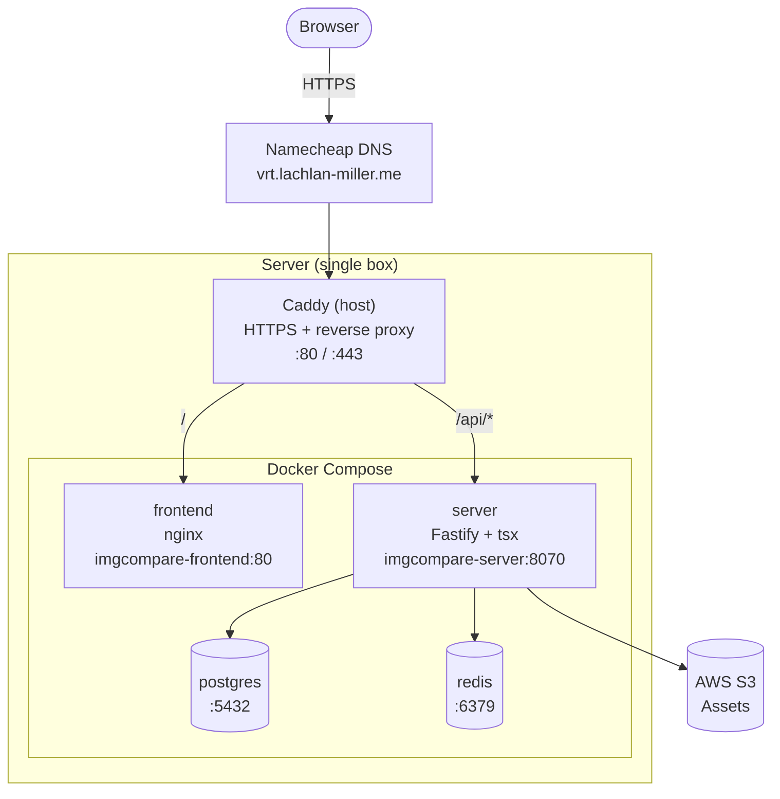

## Development

```
pnpm -r --parallel run dev
```

## Architecture



### AWS migration path

When moving to AWS, only the surrounding infrastructure changes — not the containers:

| Concern         | Self-hosted       | AWS                   |
|-----------------|-------------------|-----------------------|
| HTTPS / ingress | Caddy (host)      | ALB + ACM             |
| Frontend        | nginx container   | S3 + CloudFront       |
| API             | Fastify container | ECS Fargate           |
| Postgres        | Docker Compose    | RDS                   |
| Redis           | Docker Compose    | ElastiCache           |
| Assets          | S3                | S3 (unchanged)        |
| Secrets         | `.env` on server  | Secrets Manager / SSM |
