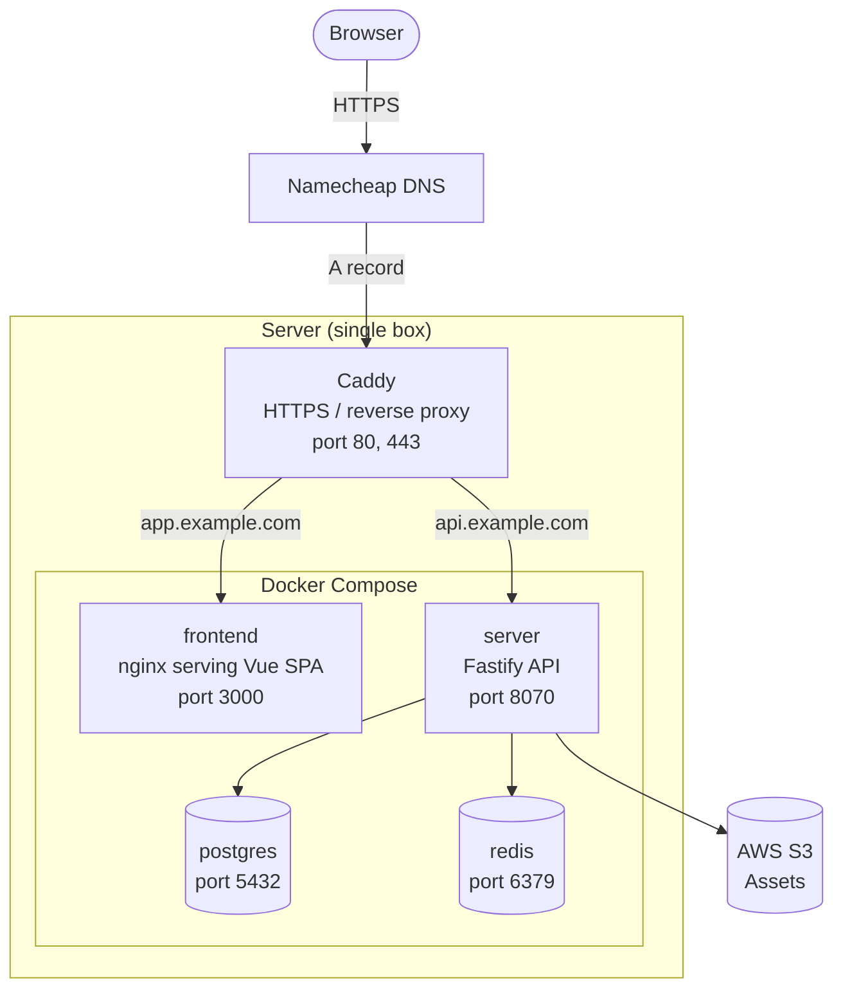
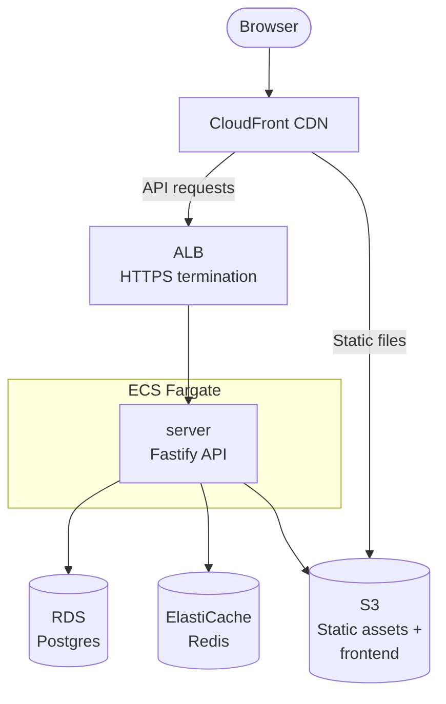

## Architecture

### Current: Self-Hosted (Single Box)



### Future: AWS



### What changes between environments

| Concern | Self-hosted | AWS |
|---|---|---|
| HTTPS / ingress | Caddy (host) | ALB + ACM cert |
| Frontend serving | nginx container | S3 + CloudFront |
| API container | Docker Compose | ECS Fargate |
| Postgres | Docker Compose | RDS |
| Redis | Docker Compose | ElastiCache |
| Assets | S3 | S3 (same) |
| Secrets | `.env` on server | Secrets Manager / SSM |

The app containers themselves don't change — only the surrounding infrastructure.
Config stays in environment variables (12-factor) so containers are portable.
```
